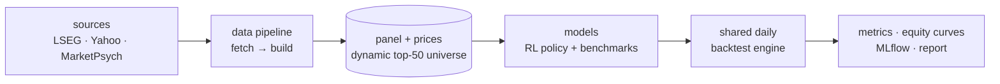

**Work In Progress**
---

# Factor Weaver

Master's thesis developing a reinforcement learning framework for portfolio management that integrates price, technical, fundamental, and behavioral (attention & sentiment) features across a dynamic equity universe of the top 50 S&P500 constituents. Uses an actor-critic architecture trained via PPO to output portfolio weights (no short-selling) maximizing risk-adjusted returns (Sharpe) under transaction costs, evaluated against benchmarks like equal-weight and minimum-variance.



## Status

- Implemented: data pipeline through prices (LSEG universe/prices, Yahoo fallback + extra series), config, CLI and workflows (`data`, `report`), tests.
- Stubbed: technicals, panel, split; all models; shared backtest engine; `train` and `eval`.

## Tech stack

- Implemented: Python, pandas, pyarrow, lseg-data, yfinance, scikit-learn, PyPortfolioOpt, MLflow, YAML configs, ruff + pyright, pytest.
- Planned: PyTorch, Gymnasium, hand-rolled PPO, cross-stock transformer, Dirichlet policy head.

## Usage

```sh
uv sync                                    # create/update .venv from uv.lock
uv run factor-weaver data                  # run all steps (fetch then build)
uv run factor-weaver data fetch [steps]    # raw data acquisition only (cached)
uv run factor-weaver data build [steps]    # derived datasets only
uv run factor-weaver data --list           # step/output status
uv run factor-weaver data fetch --refresh  # refetch cached raw data
uv run factor-weaver train rl              # train the RL policy (stub)
uv run factor-weaver eval [models ...]     # backtest models via the shared engine (stub)
uv run factor-weaver report                # compare tracked eval runs (MLflow)
```

Run from the repository root so the relative `config/` and `data/` paths resolve.
Fetch steps are existence-cached (whole outputs and per-RIC/per-symbol price caches);
`-v` logs every cache hit/fetch.

## Documentation

- [`docs/architecture.md`](docs/architecture.md) — modules, data pipeline, runtime flow
- [`docs/data.md`](docs/data.md) — sample, variables, sources
- [`docs/methodology.md`](docs/methodology.md) — environment, model architecture, evaluation
- [`docs/models.md`](docs/models.md) — benchmarks + shared backtest engine
- [`docs/literature.md`](docs/literature.md) — annotated references
