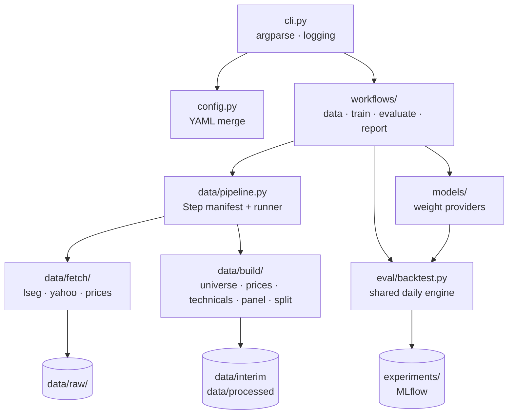

# Architecture

- modules
  - `cli.py` — argparse dispatch, logging setup (entry point)
  - `config.py` — merges `config/*.yaml` left-to-right per workflow
  - `output.py` — shared rich consoles for logs and printed output
  - `workflows/` — CLI glue: `data` (pipeline), `train` (model loop), `evaluate` (backtest), `report` (MLflow table)
  - `data/` — MODULE 1: raw sources → panel
    - `pipeline.py` — ordered `Step` manifest + dependency-aware runner
    - `store.py` — parquet writes + cache paths
    - `fetch/` — external I/O only (`lseg`, `yahoo`, `prices`); writes `data/raw/`
    - `build/` — derived data only (`universe`, `prices`, `technicals`, `panel`, `split`); writes `data/interim|processed`
  - `models/` — MODULE 2: weight-producing models (`simple`, `optimize`, `mean_variance`, `black_litterman`, `ml_forecast`, `rl/`); registry + trainers in `models/__init__.py`
  - `eval/` — MODULE 3: shared daily backtest engine + metrics

- data pipeline
  - `Step(name, run, phase, ins, outs, per_item)` declares config-key inputs/outputs
  - phases
    - `fetch` writes only `data/raw/`; existence-cached (whole outputs, or per-RIC/per-symbol inside the price steps)
    - `build` writes only `data/interim|processed`
  - selecting a step pulls the producers of missing inputs transitively (logged `+ name`); execution is always manifest order
  - `--refresh` refetches cached raw data; use it instead of deleting cache files
  - `factor-weaver data --list` prints each step's phase, outputs and existence
- weight-provider contract
  - a model is a pure function `(t, universe members, history ≤ t) → {ric: weight}`
  - Σweights = 1, long-only; cash is engine-only (forced liquidation)
  - registered by CLI name (`models.REGISTRY`), trained via `models.TRAINERS`
  - the shared engine (`eval/backtest.py`) accounts for costs, dynamic universe transitions and delistings identically for every model, including the RL policy (`models/rl/policy.py`) — see `docs/models.md`
- configs
  - `config/data.yaml` — source params and paths (LSEG, Yahoo, universe, step outputs)
  - `config/eval.yaml` — engine: fees, rebalance default, risk-free, window, MLflow
  - `config/models.yaml` — per-model params
- runtime flow
  - `factor-weaver data` → raw caches → interim/processed datasets
  - `factor-weaver train` → checkpoint artifact (+ MLflow run)
  - `factor-weaver eval` → each selected model through the shared engine → MLflow runs
  - `factor-weaver report` → MLflow query → comparison table/CSV

## Status

| Module                                         | Status      |
| ---------------------------------------------- | ----------- |
| `data/fetch/*`, `data/build/{universe,prices}` | implemented |
| `data/build/{technicals,panel,split}`          | stub        |
| `models/*`, `eval/backtest.py`                 | stub        |
| `workflows/{data,report}`                      | implemented |
| `workflows/{train,evaluate}`                   | stub        |
