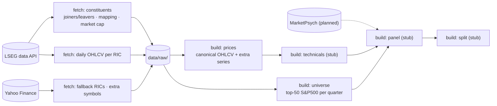

# Data

## Sample

- criteria
  - avoid selection bias
  - avoid survivorship bias
- frequency
  - daily
- period
  - 1994-2026 (universe build starts 1994, when LSEG joiner/leaver records begin)
- index
  - all S&P500 companies since 1994
- method
  - rolling top 50 companies in S&P500
  - redefine list in each period
  - exclude RICs with no price content (`universe.exclude_rics`); next-ranked company fills the slot
- alignment
  - forward-fill fundamentals from their LSEG report date with per-group staleness counter
  - time-decay for behavioral features

## Flow

Steps are existence-cached and run in manifest order; `factor-weaver data --list` shows status, `--refresh` refetches raw data (see `docs/architecture.md`).

## Variables

- for each stock
  - current passive weight
  - price
    - daily OHLCV
  - technical (stub; computed from prices)
    - moving averages
    - volume indicators
  - fundamental (planned; LSEG)
    - financial ratios
    - market info
  - behavioral (planned; MarketPsych)
    - attention
      - media coverage
      - Google search intensity
    - sentiment
      - positive/negative sentiment based on posts or news
- extra assets
  - risk-free - `^IRX` (T-bill annualized yield, not a price)
  - S&P500 stock index - `^GSPC`
- market-wide indicators
  - VIX - `^VIX`

## Sources

- equity universe
  - LSEG data API — S&P500 constituent list, joiner/leaver history, RIC mapping; market cap via `TR.CompanyMarketCap` (fallback `TR.F.MktCap`) for top-50 selection
  - `build/universe.py` also writes `data/interim/assets.parquet`, the distinct RIC → ticker/name/permid registry used by the price steps
- price
  - LSEG data API — daily OHLCV (RTS-adjusted), primary source; per-RIC cache in `data/raw/lseg/prices/`
  - stale RICs retargeted via `lseg.ric_fallbacks` (FSR.N^B01 → USB.N, KHC.OQ → KHC.N), rows relabelled
  - <https://finance.yahoo.com/> via `yfinance` — fallback for RICs without LSEG content (validated against the universe membership window) and source for the configured `extra_symbols` (`^GSPC`, `^VIX`, `^IRX`); fallback rows land in `prices.parquet`, extras in `data/interim/extra_prices.parquet`; per-symbol cache in `data/raw/yahoo/prices/`
- fundamental
  - LSEG data API — planned, not yet implemented (`build/panel.py` is the integration point)
- technical
  - computed from prices (moving averages, volume indicators); `build/technicals.py` is a stub
- behavioral
  - <https://www.marketpsych.com/> — planned, not yet implemented

## Issues

### Universe

- **Joiner/leaver history starts with a baseline snapshot in 1994**: phantom "Joiner"
  events for companies already in the index pre-1994. Top-50 universe should be unaffected
- **No market cap for some retired RICs**: a few delisted RICs (`^`-suffixed)
  return nothing for `TR.CompanyMarketCap` or `TR.F.MktCap`. Dropped from top-50 ranking in
  their active quarters; only names near the 1999-2001 boundary are affected.
- **Membership ~20 names short pre-2000**: the joiner/leaver file has ~20 more Leaver than
  real Joiner events before 2000, so reconstructed membership counts 477-505 vs. ~500
  (1994: 478). Top-50 universe should be unaffected.

### Prices

- **Retired RICs with no price content**: FSR.N^B01 sourced from USB.N (same PermID,
  `lseg.ric_fallbacks`); ENE.N^A02 has no LSEG or Yahoo content and is excluded
  (`universe.exclude_rics`), next-ranked company backfills its 2 quarters (2000Q3/Q4)
- **Adjustment basis differs across vendors**: LSEG RTS vs Yahoo split/dividend-adjusted
  (back-adjusted on each dividend); Yahoo rows only fill LSEG gaps
- **Existence-based caches**: reference files and per-RIC/per-symbol price caches are
  skipped when present; use `factor-weaver data fetch --refresh` (optionally per step,
  e.g. `data fetch lseg-constituents --refresh`) instead of deleting files
